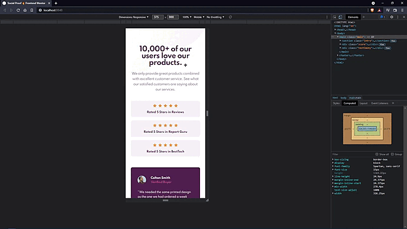
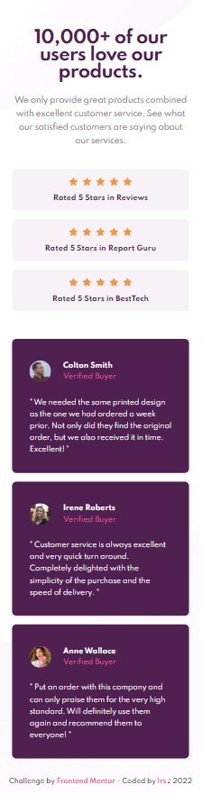
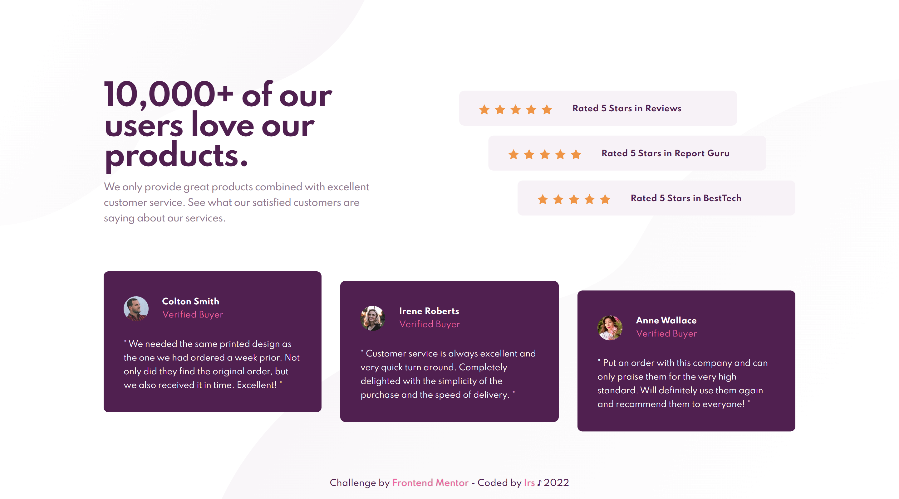

# Frontend Mentor - Social proof section solution

Hi 👋

This is a solution to the [Social proof section challenge on Frontend Mentor](https://www.frontendmentor.io/challenges/social-proof-section-6e0qTv_bA). 

If you liked my solution, give me 🌟. Thank you 😉

## Table of contents

  - [The challenge](#the-challenge)
  - [Screenshot](#screenshot)
  - [Link](#link)
  - [Built with](#built-with)
  - [Author](#author)

## The challenge

Users should be able to:

- View the optimal layout for the section depending on their device's screen size

## Screenshot

- Mobile

- Desktop

## Link

- [Live](https://irs-mp.github.io/social-proof/) 👀

## Built with

- Mobile-first workflow
- Semantic HTML5 markup
- CSS custom properties
- Flexbox
- CSS Grid

## Author

- Frontend Mentor - [@Irs-mp](https://www.frontendmentor.io/profile/Irs-mp)
- Twitter - [@Irs_mp](https://twitter.com/Irs_mp)
